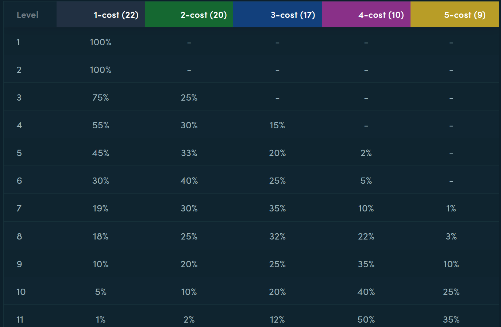

# Bronze Teams — Early Compositions & "Bronze For Life" Augment Finder

**What is Teamfight Tactics?**
- Teamfight Tactics (TFT) is an auto-battler strategy game by Riot Games where players draft and position a team of champions that then fight automatically each round.
- Players manage gold, level (board size), and champion selection, while building synergies called traits (origins/classes) that grant bonuses when multiple champions of the same trait are fielded.
- Augments are one-time game modifiers that grant bonuses or change strategy; "Bronze For Life" style augments reward low-cost trait activations and early-game stability.

This small Python project finds the best early-team compositions for Teamfight Tactics (TFT) that maximize the number of "bronze"-level traits (useful for early-stage/low-cost comps and "Bronze For Life" augment targets).

The included script scrapes champion data from Mobalytics, filters champions legal for a given player level (board cap) by cost, enumerates candidate teams, and ranks them by how many traits reach their "bronze" activation threshold.

Rerolls goes as following:



**Why this exists**: If you want reliable early compositions that activate many bronze-tier traits (easy-to-hit synergies for low-roll players or augment choices), this tool helps you discover the strongest low-cost teams and inspect which traits and counts make them effective.

**Files**
- [BronzeTeams.py](BronzeTeams.py) — main script. Scrapes champion cards, defines trait bronze thresholds, enumerates legal teams for a given level, and prints best teams.

**Features**
- Scrapes champions and attributes from Mobalytics.
- Filters champions by cost cap per level (see `LEVEL_MAX_COST` in the script).
- Counts trait occurrences and determines which traits meet bronze thresholds.
- Exhaustively enumerates combinations for a given level and team size and ranks best results.

Requirements
- Python 3.8+
- Packages: `requests`, `beautifulsoup4`

Install dependencies

```bash
pip install requests beautifulsoup4
```

Usage

1. Open the script `[BronzeTeams.py](BronzeTeams.py)` and adjust parameters near the bottom if needed (for example: `level`, `team_size`, `top_n`, `excluded_champions`).
2. Run:

```bash
python BronzeTeams.py
```

By default the script runs `best_bronze_team_legal(..., level=4, top_n=1000)` and prints each top combination like:

```
#1 bronze=5 team=('ChampionA','ChampionB',...)
	bronze traits: Bruiser, Defender, ...
```

Key parameters
- `level` — player level / board cap. Determines `max_cost` allowed via `LEVEL_MAX_COST` in the script.
- `team_size` — optional team size (defaults to `level`). Must be <= `level`.
- `top_n` — how many top teams to print.
- `excluded_champions` — list champions to omit (script already includes several known non-standard entries).

Algorithm overview
- The script builds a champion pool containing only champions with cost <= allowed max cost for the selected level.
- It enumerates all combinations of that pool of size `team_size` using `itertools.combinations`.
- For each team it counts attribute occurrences and determines which attributes reach their bronze threshold (defined in `traits` and computed via `_bronze_threshold`).
- Teams are scored by the number of bronze traits they activate; ties are broken by number of distinct traits present and then lexicographically by team.

Customization & tuning
- Bronze thresholds and trait definitions are in the `traits` mapping near the top of the script — edit these values to match your desired activation thresholds.
- `LEVEL_MAX_COST` controls what champion costs are allowed per level. Tweak these if the game rules or your goals differ.
- If the scrape fails due to site layout changes, inspect the selectors in the scraping section and update them.
- For large enumerations (high level and large champion pool) the combination count grows quickly. Use smaller `team_size` or filter `champion_names` by hand to keep runtimes reasonable.

Notes & limitations
- The script scrapes a live website; it may break if the target site changes markup or if scraping is blocked. Use respectfully and add caching if you plan repeated runs.
- This is an exhaustive combinatorial search — no heuristics or pruning beyond cost filtering are used.
- The results assume the `attributes` scraped match the trait names used in the `traits` mapping; mismatches will reduce accuracy.

Examples
- To find the best level-3 teams restricted to 3-cost or less, set `level=3` and run the script.
- To only consider teams of size 4 at level 5, set `level=5, team_size=4`.

Contributing
- Fix bugs or improve trait thresholds by editing `BronzeTeams.py`. If you add automated tests or a requirements file, include installation steps.

License
- See the top-level `LICENSE` file in this repository for license terms.

Questions or next steps
- Want me to add a `requirements.txt`, or add a CLI wrapper so you can easily pass `level`/`team_size` from the command line? Tell me which and I can add it.

